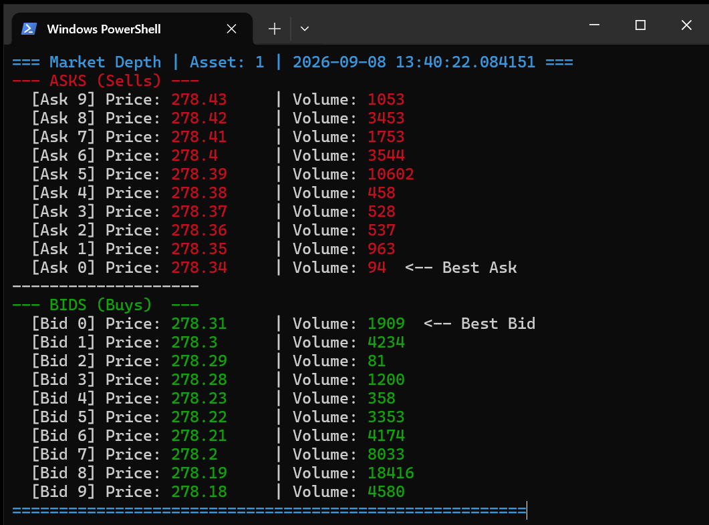
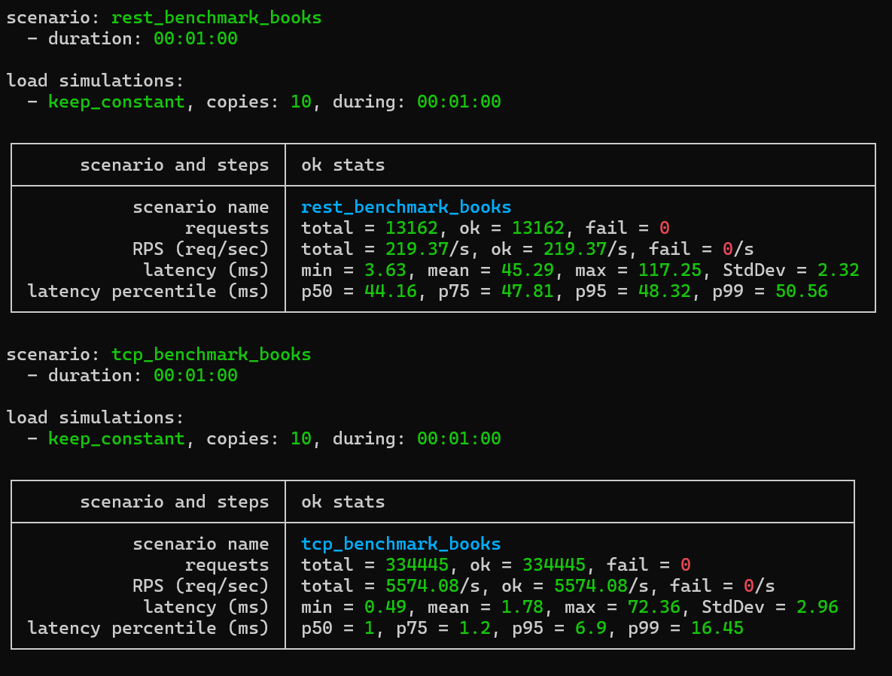

# vertr-market

## Система обработки и хранения рыночных данных

Сервис слушает потоки рыночных данных (стаканов котировок) из биржи и сохраняет их в InMemory объектное хранилище.

Работа с хранилищем реализована через две версии API:
- REST: IMarketRestApiClient
- TCP: IMarketTcpApiClient

## Архитектурная схема


### Структура кода

- **`/src`**: Основная папка с исходным кодом
  - `/Market.ApiClient/`: Клиентская библиотека для доступа к API сервиса. Реализует REST и TCP API.
  - `/Market.ConsoleApp/`: Демонстрационное консольное приложение, использующее API клиента для доступа к хранилищу
  - `/Market.Core/`: Доменная модель и основные сущности приложения.
  - `/Market.Gateways.Tinvest/`: Шлюз для получения и сохранения рыночных данных из T-invest API
  - `/Market.Host/`: ASP.NET Web API хост плюс TCP сервер как BackgroundService
- **`/tests`**: Набор тестов
  - `/Market.Benchmarks/`: Перформанс тесты на основе NBomber
- **`/docs`**: Документация

### Key Configuration Files
- **`.editorconfig`**: Code formatting rules, null annotations, diagnostic configurations
- **`Directory.Build.props`**: Shared MSBuild properties across all projects
- **`Market.slnx`**: Main solution file (XML-based solution format)

### Ключевые технические моменты

- InMemory Object Store использует ReaderWriterLockSlim для эффективного доступа и Interlocked для сбора статистики
- Асинхронный TCP-сервер использует System.IO.Pipelines
- Парсер команд реализован с использованием MemoryPack


## Инфраструктура

Хост сервиса и фид рыночных данных (T-инвест) поднимаются в Docker контейнере - файл compose.yaml в корне солюшена.

В Docker контейнере также разворачивается инфраструктура для сервиса - файл compose.yaml в папке infra:

- Jaeger для трейсов
- Prometheus для метрик
- Grafana для отображения дашбордов

## Запуск и примеры использования

1. Собрать и запустить инфраструктуру 

```
cd infra
docker-compose up -d
```

2. Собрать и запустить связку сервисов: Хост и Т-инвест фид

В файле Market.Gateways.Tinvest\appsettings.Docker.json необходимо указать AccessToken для T-Invest API - 

```
cd ..
docker-compose build
docker-compose up -d
```

3. Запустить демо-консоль и убедиться, что рыночные данные приходят и сохраняются

Рыночные данные (стаканы котировок) будут обновляться только в рабочие часы Мосбиржи.

```
cd src\Market.ConsoleApp
dotnet run 
```




## Ендпоинты

- Swagger REST API: [http://localhost:7001/swagger](http://localhost:7001/swagger)
- Метрики хоста доступны по адресу: [http://localhost:7001/metrics](http://localhost:7001/metrics)
- Так же метрики в Prometheus: [http://localhost:9090/query](http://localhost:9090/query)
- Трейсы: [http://localhost:16686/search](http://localhost:16686/search)
- Дашборд: [http://localhost:3000/dashboards](http://localhost:3000/dashboards)

## Нагрузочные тесты

Для нагрузочных тестов реализовано два сценария (см. tests\Market.Benchmarks\Program.cs):

- с использованием REST API
- с использованием TCP API

Запуск сценариев:

```
cd tests\Market.Benchmarks
dotnet run --configuration Release
```



## Настройка дашборда для Grafana

Можно импортировать готовые дашборды

- https://grafana.com/grafana/dashboards/20568-opentelemetry-dotnet-webapi/
- https://github.com/petabridge/dotnet-grafana-dashboards
- https://grafana.com/grafana/dashboards/24163-dotnet-performance-with-hsn/


